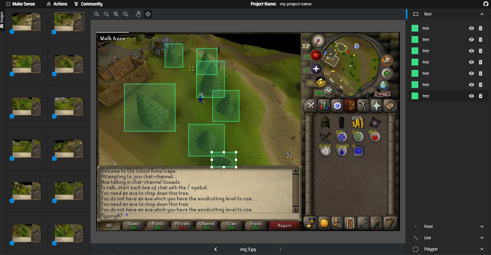
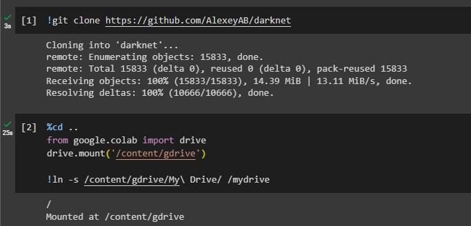
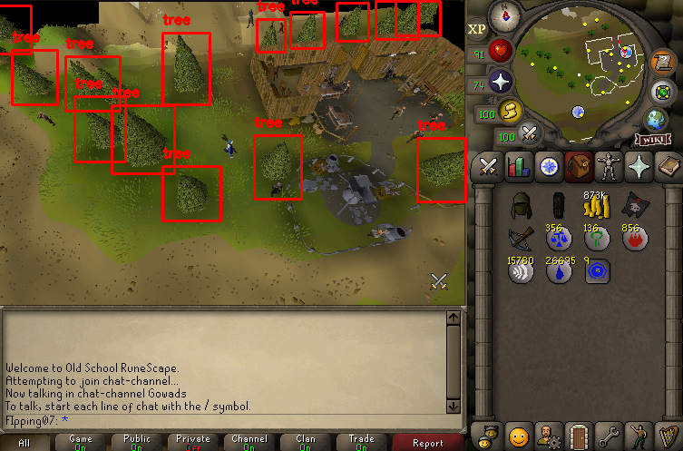
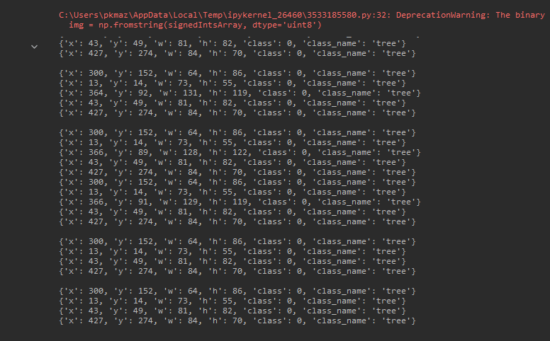

# Real-Time Object Detection in Video Games using YOLOv4 and OpenCV

This project involves developing a Python-based application that uses YOLOv4 and OpenCV for real-time object detection in video games. The game of focus was "Old School RuneScape", specifically detecting trees within the game.

## Project Overview

The project encompasses several stages including dataset generation, image annotation, model training, and model implementation for object detection.

## Steps

1. **Dataset Generation**: The first step involved generating a dataset of in-game screenshots. This dataset served as the basis for training the object detection model. For more details, refer to the `1_generate_dataset.ipynb` notebook.

    

2. **Image Annotation**: The images were then manually annotated using the `makesense.ai` tool. This tool allows for custom annotation of images and exports the annotations in YOLO format, which is compatible with the YOLOv4 model. For more details, refer to the `2_label_dataset.ipynb` notebook.

    

3. **Model Training**: The annotated images were used to train a YOLOv4 Tiny model. The training was performed on Google Colab, leveraging its GPU capabilities for efficient computation. The Darknet open-source neural network framework was used for the implementation of YOLOv4. For more details, refer to the `3_yolo_model_training.ipynb` notebook.

    

4. **Model Implementation**: The trained model was then implemented for real-time object detection in the game using OpenCV. The model was able to detect and identify trees in the game in real-time. For more details, refer to the `4_yolo_opencv_detector.ipynb` notebook.

    

## Technologies Used

- Python
- YOLOv4
- OpenCV
- Google Colab
- Darknet
- makesense.ai
- win32gui
- win32ui
- win32con

## Results

The project was successful in achieving real-time object detection with high accuracy. The code was refactored and documented for better readability and maintainability.

## Future Work

Future improvements can include expanding the detection to other objects in the game, improving the detection accuracy, and optimizing the code for better performance. Also updating to YOLOv8 and annotating more than 30 images would give better results. 

## License

This project is licensed under the MIT License - see the [LICENSE.md](LICENSE.md) file for details.
